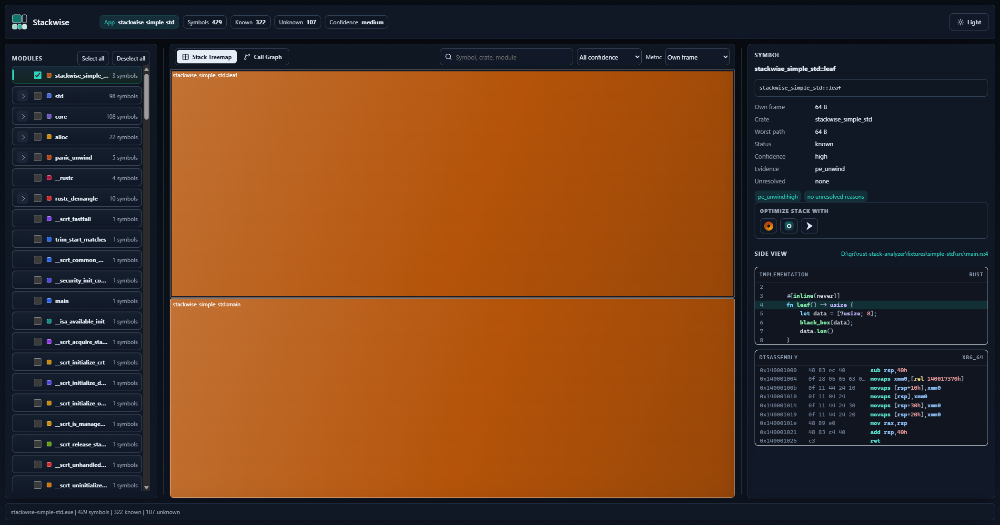
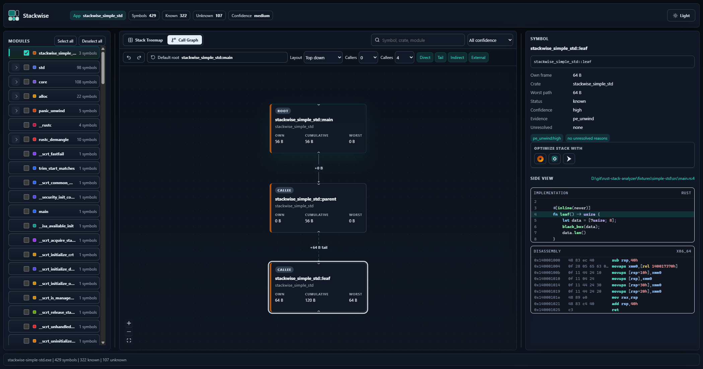
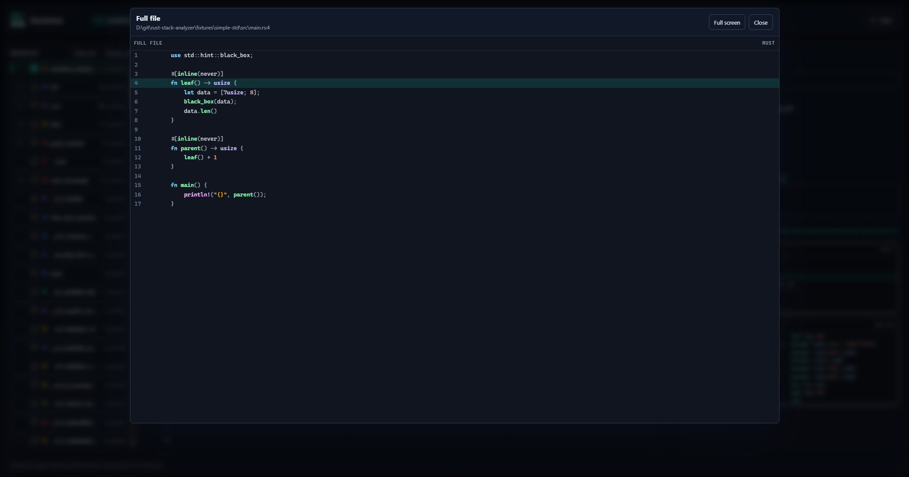

# Stackwise

**Stackwise maps the stack cost of your Rust binaries.**

It is a drop-in CLI and local UI for answering a simple question:

> Which emitted functions can consume the most stack, and why?

No macros. No instrumentation. No source changes. Stackwise analyzes the final artifact your project already builds, so release profiles, custom targets, LTO, and stripped symbols are handled as reality, not theory.

## Quick Start

```powershell
cargo install stackwise
cargo stackwise --release --open
```

This builds your current Cargo project, writes a JSON report under `target/stackwise/`, and opens an interactive treemap UI.
Use `--serve` instead of `--open` when you want Stackwise to print a local URL without opening your browser.

## Screenshots

**Stack treemap.** Find the frames that matter, grouped by module, with source and disassembly beside the selected symbol.



**Call graph.** Follow stack growth from caller to callee and see cumulative stack on every branch.



**Source reader.** Jump from symbols into a focused, syntax-highlighted full-file view.



## What You Get

- **Drop-in analysis** for existing Rust projects.
- **Versioned JSON reports** for CI, dashboards, and custom tooling.
- **Interactive treemap UI** inspired by WinDirStat.
- **Confidence-first results**: unknown stack data is reported as unknown, never as fake zeroes.
- **Artifact-first behavior** across build profiles, targets, and optimization modes.

## CLI

- `stackwise analyze <artifact> --json report.json`
- `cargo stackwise --release --open`
- `cargo stackwise --release --serve`
- `stackwise open report.json`
- `stackwise open report.json --serve`
- `stackwise check report.json --max-own-frame 4096`
- `stackwise doctor`
- `stackwise schema --json`
- `stackwise init`

## Status

Stackwise is early, but already end-to-end: PE/COFF unwind analysis, ELF `.stack_sizes` parsing, JSON export, budget checks, and a local treemap UI are in place.

Exact stack metadata is used where available. Everywhere else, Stackwise preserves evidence and confidence so reports stay useful and honest.
